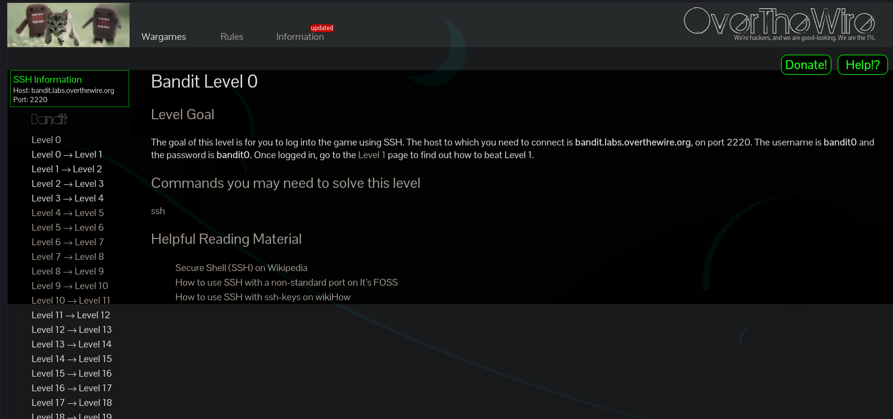
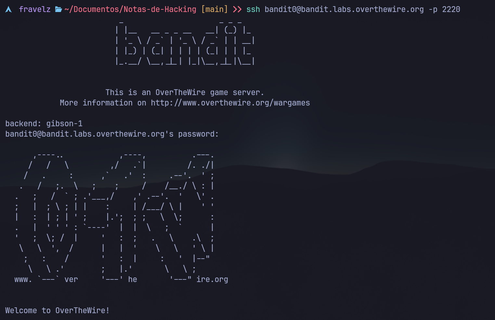

# Resolución problemas básicos de Bandit

---

## Temario

- [Resolución problemas básicos de Bandit](#resolución-problemas-básicos-de-bandit)
  - [Temario](#temario)
  - [Información](#información)
  - [Bandit0](#bandit0)
  - [Bandit1](#bandit1)
  - [Bandit2](#bandit2)
  - [Bandit3](#bandit3)
  - [Bandit4](#bandit4)
  - [Bandit5](#bandit5)
  - [Bandit6 (contiene clave siguiente)](#bandit6-contiene-clave-siguiente)

---

## Información

Página para practicar, comandos linux, desde la terminal.

Página Web: https://overthewire.org/wargames/bandit/

SSH Información

Host:

``` bash
bandit.labs.overthewire.org
```

``` bash
Port: 2220
```

<details>
  <summary>Comando ssh para conectarse a bandit</summary>
  Para conectarse a bandit0 se puede hacer con el siguiente comando:

  ``` bash
  ssh bandit0@bandit.labs.overthewire.org -p 2220
  ```

  Después de conectarte al servicio, bandit te pedirá una contraseña, en este caso la contraseña es

  ``` bash
  bandit0
  ```

  En vez de colocar bandit0 colocas bandit1 para el siguiente nivel, en cada nivel debes obtener una contraseña, que se dará las instrucciones en la página web ([Ir a página web (overthewire, bandit)](https://overthewire.org/wargames/bandit/)), para completar cada nivel y obtener dicha contraseña del siguiente nivel.
</details>

El propósito de este archivo, es dar pistas sencillas en español de los niveles, y además tener a mano la solución en dado, caso de querer saltar algún nivel, para luego estudiarlo.

Aunque, en la página oficial, ya hay material, para aprender, y pistas de como resolver los ejercicios (todo en ingles).

Pagina web:



Terminal:



---

## Bandit0

**Pista:** Solo hay que leer.

<details>
  <summary>Posible solucion</summary>

  ``` bash
  cat readme.md
  ```

</details>

---

## Bandit1

**Pista:** solo hay que leer de otra forma.

<details>
  <summary>Posible solucion</summary>

  ``` bash
  cat ./-
  ```

</details>

---

## Bandit2

**Pista:** solo hay que leer igual que el anterior pero con unas cosas extras.

<details>
  <summary>Posible solucion</summary>

  ``` bash
  cat "./--spaces in this filename--"
  ```

</details>

---

## Bandit3

**Pista:** Igual que la anterior, pero solo hay un directorio con un archivo oculto.

<details>
  <summary>Posible solucion</summary>

  ``` bash
  cat "inhere/...Hiding-From-You"
  ```

</details>

---

## Bandit4

**Pista:** el archivo que sea tipo texto es el que tendrá la clave.

<details>
  <summary>Posible solucion</summary>

  ``` bash
  find ./inhere/ -type f | xargs file
  ```

  El archivo que sea ascii text, es el que contendrá la clave para el siguiente nivel.

</details>

---

## Bandit5

**Pista:**

- legible para humanos
- 1033 bytes de tamaño
- no ejecutable

<details>
  <summary>Posible solucion</summary>

  ``` bash
  find ./inhere/ -type f -size 1033c
  ```

  Dará la ruta del archivo que cumpla con los requisitos de tamaño si hay solo 1, ese tendrá la clave.

</details>

---

## Bandit6 (contiene clave siguiente)

**Pista:**

- Propiedad del usuario bandit7
- Propiedad del grupo bandit6
- Tamaño: 33 bytes

<details>
  <summary>Posible solucion</summary>

  ``` bash
  find / -user bandit7 -group bandit6 -size 33c 2>/dev/null
  ```

  Mostrará la dirección del archivo que tendrá la clave.

</details>

<details>
  <summary>Clave para el siguiente</summary>

  ``` bash
  morbNTDkSW6jIlUc0ymOdMaLnOlFVAaj
  ```

</details>

---

...

---

> **Autor:** Fravelz
