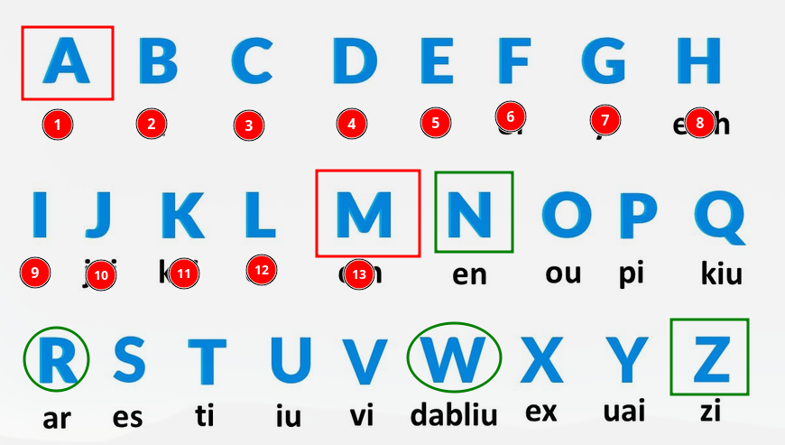

# Cifrado Cesar con tr en Linux

---

## Temario

- [Cifrado Cesar con tr en Linux](#cifrado-cesar-con-tr-en-linux)
  - [Temario](#temario)
    - [Parte 1](#parte-1)
    - [Parte 2](#parte-2)
    - [3. Qué hace exactamente este caso](#3-qué-hace-exactamente-este-caso)
    - [Ejemplo práctico](#ejemplo-práctico)
    - [En resumen](#en-resumen)

[Regresar a la Guía Principal](./../../readme.md#5-python)

---

El comando que vamos a revisar y analizar que hace cifrado cesar de 13 caracteres hacia delante:

``` bash
cat data.txt | tr '[A-Za-z]' '[N-ZA-Mn-za-m]'
```

---

### Parte 1

``` bash
cat data.txt
```

Muestra el contenido del archivo `data.txt` (lo envía al *stdout*).

---

### Parte 2

``` bash
| tr '[A-Za-z]' '[N-ZA-Mn-za-m]'
```

El **pipe (`|`)** pasa ese texto al comando **`tr`**, que significa *translate* (traducir o sustituir caracteres).

La sintaxis:

``` bash
tr 'caracteres_originales' 'caracteres_nuevos'
```

sustituye cada carácter del primer conjunto por el correspondiente del segundo.

---

### 3. Qué hace exactamente este caso

`[A-Za-z]` → todas las letras del alfabeto (mayúsculas y minúsculas).

`[N-ZA-Mn-za-m]` → es el mismo alfabeto, pero **rotado 13 posiciones**.

👉 Esto significa que cada letra se reemplaza por la letra que está 13 lugares después en el alfabeto.

A eso se le llama **cifrado ROT13 (Rotation by 13 places)**.

Es decir de la N-Z es 13 posiciones, de la A-M, de la n-z y de la a-m, todas son 13 posiciones, continuación una imagen representativa:



---

### Ejemplo práctico

Si `data.txt` contiene:

``` txt
Hola Mundo
```

El comando:

``` bash
cat data.txt | tr '[A-Za-z]' '[N-ZA-Mn-za-m]'
```

producirá:

``` txt
Uby nZhaqb
```

Y si vuelves a aplicarlo una segunda vez, vuelve al texto original (porque ROT13 es su propio inverso).

---

### En resumen

Este comando aplica el **cifrado ROT13** al texto del archivo `data.txt`, sustituyendo cada letra por la que está 13 posiciones más adelante en el alfabeto (y viceversa si se aplica de nuevo).

--

[Regresar a la Guía Principal](./../../readme.md#5-python)

> **Autor:** Fravelz
