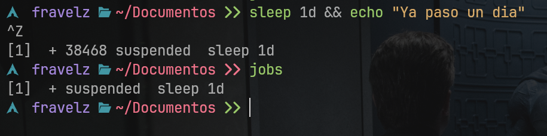

# Gestión de procesos

---

## Temario

- [Gestión de procesos](#gestión-de-procesos)
  - [Temario](#temario)
  - [Terminologías](#terminologías)
  - [Comandos para ver procesos](#comandos-para-ver-procesos)
  - [Ejecución de procesos](#ejecución-de-procesos)
  - [Control de trabajos](#control-de-trabajos)
  - [Señales a procesos](#señales-a-procesos)
  - [Prioridades de procesos](#prioridades-de-procesos)
  - [Espera y sincronización](#espera-y-sincronización)
  - [Redirección y procesos](#redirección-y-procesos)
  - [Información de procesos](#información-de-procesos)
  - [Procesos huérfanos y zombis](#procesos-huérfanos-y-zombis)
  - [Resumen visual](#resumen-visual)

[Regresar a la guía principal](./../readme.md#2-linux-y-bash-script)

---

## Terminologías

- **Proceso**: Programa en ejecución administrado por el kernel.

- **PID (Process ID)**: Identificador único asignado por el sistema a cada proceso.

- **PPID (Parent PID)**: Identificador del proceso padre (quien lo creó).

- **Estado**: Indica el estado actual del proceso:

  - `R` → ejecutándose (Running)
  - `S` → durmiendo (Sleeping)
  - `T` → detenido (Stopped)
  - `Z` → zombi (Zombie)

- **Señales**: Mensajes que el kernel o el usuario pueden enviar a un proceso (ej: `SIGKILL`, `SIGSTOP`, `SIGINT`).

---

## Comandos para ver procesos

- **`ps`**: Lista los procesos activos.

  ```bash
  ps aux                # Para monitoreal recursos
  ps -ef                # Para ver gerarquia y relaciones entre los procesos
  ```

- **`top` / `htop`**: Monitor interactivo de procesos.

  `htop` es más visual, permite matar o renicear procesos fácilmente.

- **`pgrep`**: Busca procesos por nombre.

  ```bash
  pgrep firefox
  ```

- **`pstree`**: Muestra los procesos en forma jerárquica (padre-hijo).

  ```bash
  pstree -p   # incluye los PIDs
  ```

- **`pidof`**: Muestra el PID de un programa activo.

  ```bash
  pidof bash
  ```

---

## Ejecución de procesos

- **Primer plano (foreground)**:

  ```bash
  ./programa
  ```

  El terminal queda ocupado hasta que el proceso termine.

- **Segundo plano (background)**:

  ```bash
  ./programa &
  ```

  El shell sigue disponible mientras el proceso corre. Tener en cuenta que normalmente al cerrar la shell el proceso se termina, pero se puede utilizar el comando `disown` en la shell para que el proceso, no dependa de la shell.

- **Ejemplo práctico:**

  ```bash
  long_task.sh &
  echo "Sigo usando la terminal"
  ```
  
---

## Control de trabajos

Bash permite gestionar procesos iniciados desde la misma sesión (misma terminal en el que se ejecutó el proceso).

```bash
jobs          # lista los procesos de fondo en la sesión actual
fg %1         # lleva el job 1 al primer plano
bg %2         # reanuda el job 2 en segundo plano
Ctrl + Z      # pausa el proceso actual
```

**Ejemplo:** Creamos un proceso en la terminal:

``` bash
sleep 1d && echo "Ya paso 1 dia"
```

Luego das `Ctrl+Z` se pausa el proceso (importante no equivocarse con `Ctrl+C` porque este terminaría el proceso en vez de pausarlo), cuando escribas:

``` bash
jobs
```

Podrás visualizar el proceso, todo se vería algo así:



Con el comando `fg %1` o `bg %1` puedes des pausar el proceso, con las implicaciones que si dieron arriba.

Si usas `disown` en terminal despegas el proceso de la terminal (de la sección).

con `ps aux | grep sleep` encuentras el proceso en segundo plano, filtrando con grep, copias el PID que es el primer número después del usuario (supongamos que es 12345 el PID en cada dispositivo es diferente el numero) y haces:

``` bash
kill 12345
```

Así apagas el proceso que previamente habías convertido en proceso de segundo plano sin estar conectado a la shell.

---

## Señales a procesos

- **Enviar señales manualmente:**

  ```bash
  kill -9 1234    # SIGKILL (fuerza el cierre)
  kill -15 1234   # SIGTERM (solicita terminación limpia)
  kill -STOP 1234 # pausa proceso
  kill -CONT 1234 # reanuda proceso detenido
  ```

- **Por nombre:**

  ```bash
  pkill firefox
  killall nano
  ```

- **Listar señales disponibles:**

  ```bash
  kill -l
  ```

Algunos nombres comunes:

| Señal     | Código | Descripción                               |
| --------- | ------ | ----------------------------------------- |
| `SIGTERM` | 15     | Terminación elegante                      |
| `SIGKILL` | 9      | Termina sin limpiar recursos              |
| `SIGSTOP` | 19     | Detiene temporalmente                     |
| `SIGCONT` | 18     | Reanuda ejecución                         |
| `SIGINT`  | 2      | Interrupción (Ctrl + C)                   |
| `SIGHUP`  | 1      | Cierre de terminal o reinicio de servicio |

---

## Prioridades de procesos

Cada proceso tiene un **“valor bueno”**, que define su prioridad de CPU.

- Rango: **-20 (mayor prioridad)** a **19 (menor prioridad)**.
- Valor por defecto: **0**.
- Solo `root` puede asignar valores negativos.

**Cambiar prioridad al iniciar:**

```bash
nice -n 10 ./programa
```

**Modificar proceso existente:**

```bash
renice -n 5 -p 1234
```

**Ver prioridades actuales:**

```bash
ps -eo pid,ni,comm
```

---

## Espera y sincronización

- **`wait`**: Espera que un proceso hijo termine.

  ```bash
  ./script_largo.sh &
  wait   # espera que finalicen todos los procesos en segundo plano
  ```

  También se puede usar con PID:

  ```bash
  wait 1234
  ```

- **`sleep`**: Pausa ejecución durante un tiempo.

  ```bash
  sleep 5   # espera 5 segundos
  ```

- **Ejemplo combinado:**

  ```bash
  ./task1.sh & ./task2.sh &
  wait
  echo "Ambos procesos terminaron."
  ```

---

## Redirección y procesos

- **Enviar salida a archivo y ejecutar en background:**

  ```bash
  ./script.sh > salida.log 2>&1 &
  ```

- **Separar proceso de la terminal:**

  ```bash
  disown
  ```

- **Evitar que termine al cerrar sesión:**

  ```bash
  nohup ./programa > out.log 2>&1 &
  ```

- **Ejecución persistente con `setsid`:**

  ```bash
  setsid ./programa &
  ```

  Crea una nueva sesión, sin conexión con la terminal actual.

---

## Información de procesos

- **Directorio `/proc`** (virtual):
  Contiene información detallada del sistema y procesos.

  ```bash
  cat /proc/1234/status
  cat /proc/1234/cmdline
  cat /proc/cpuinfo
  ```

- **`lsof`**: Lista archivos abiertos por un proceso.

  ```bash
  lsof -p 1234
  ```

- **`strace`**: Muestra las llamadas al sistema realizadas por un proceso (muy útil para depuración).

  ```bash
  strace -p 1234
  ```

---

## Procesos huérfanos y zombis

- **Huérfano**: cuando el proceso padre termina antes que su hijo.
  El proceso hijo pasa a ser adoptado por el **init*- o **systemd**.
  No es dañino, pero indica una gestión no controlada de procesos.

- **Zombi**: proceso que terminó, pero su entrada en la tabla de procesos aún existe porque su padre no leyó su estado de salida (`wait()` no fue llamado).
  Se muestran con estado `Z`:

  ```bash
  ps aux | grep 'Z'
  ```

  Para eliminarlos, normalmente basta con terminar el proceso padre.

---

## Resumen visual

| Acción                   | Comando / Descripción                 |
| ------------------------ | ------------------------------------- |
| Listar procesos          | `ps aux`, `top`, `htop`               |
| Buscar por nombre        | `pgrep nombre`, `pidof nombre`        |
| Árbol de procesos        | `pstree -p`                           |
| Ejecutar en background   | `comando &`                           |
| Ver jobs                 | `jobs`                                |
| Pausar proceso           | `Ctrl + Z`, `kill -STOP PID`          |
| Reanudar proceso         | `bg %n`, `kill -CONT PID`             |
| Traer a foreground       | `fg %n`                               |
| Terminar proceso         | `kill -9 PID`, `pkill nombre`         |
| Cambiar prioridad        | `nice`, `renice`                      |
| Esperar procesos         | `wait`, `sleep`                       |
| Ignorar cierre de sesión | `nohup comando &`, `disown`           |
| Ver info detallada       | `cat /proc/PID/status`, `lsof -p PID` |

---

[Regresar a la guía principal](./../readme.md#2-linux-y-bash-script)

> **Autor**: Fravelz
